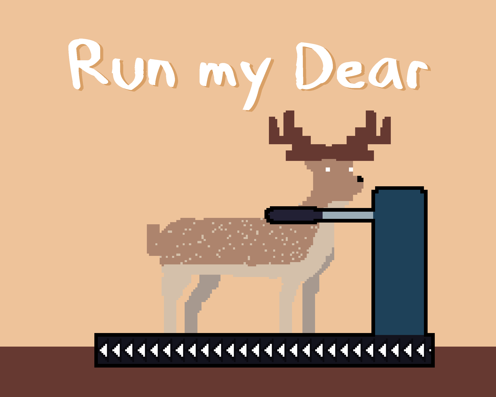

# Run my Dear LD49

a Mini game where you play as a deer exercising on an UNSTABLE treadmill that is changing its speed unpredictably,
made for Ludum Dare 49 and the theme was (Unstable).

The game was made in 48 hours using Python with the module Pygame and my small engine.

play the game on [itch.io](https://omarmobadr.itch.io/run-my-dear)




## Getting Started

to run the code on your machine follow these steps:
1. clone the repo

```git clone https://github.com/OmarMoBadr/Run-my-Dear-LD49.git```

2. navigate to the folder

```cd Run-my-Dear-LD49```

3. install pygame if you don't have it already

```pip install pygame```

if the above command didn't work watch this video [for Windows](https://www.youtube.com/watch?v=AdUZArA-kZw) or [for Mac](https://www.youtube.com/watch?v=E-WhAS6qzsU&)

4. run ``main.py``

```python main.py```
